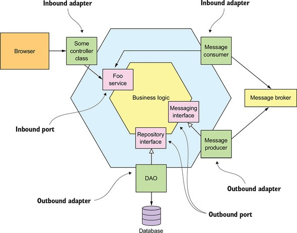

<div align="center">


</div>

<div align="center">

# Heimdall
##  Serviço de Segurança para Authentication e Authorization.


</div>

<div align="center">

# Origem do Nome - Heimdall
Na mitologia nórdica, Heimdall é um deus, filho de Odin e nove mães, que tem como missão guardar a ponte Bifrost, um arco-íris ligando o céu à Terra, e de tocar o retumbante chifre Gjallarhorn, quando da aproximação do fim do mundo, o Ragnarök. Cavalga o cavalo-guará dourado Gulltoppr, além de possuir dentes de ouro, e ser filho de nove mães.

Heimdall é atestado como portador da presciência, visão aguçada e audição, é descrito como "o mais alvo dos deuses", e mantém o relógio para o início do Ragnarök ao beber muito hidromel em sua morada, Himinbjörg, localizada onde a ponte arco-íris Bifröst queima ao encontrar-se com o céu. Heimdall é dito como o autor das classes sociais entre os homens, uma vez que ele recuperou o tesouro Brísingamen de Freyja enquanto lutava com a forma lacrada de Loki, ambos são destinados em seus futuros a se matarem durante os eventos do Ragnarök. Heimdall é igualmente designado como Hallinskiði, Gullintanni e Vindler ou Vindhlér.

</div>

<div align="center">

## Arquitetura



</div>

<div align="center">

## Sonar
[](https://sonarcloud.io/dashboard?id=FelipeFenrir_Heimdall)

[](https://sonarcloud.io/dashboard?id=FelipeFenrir_Heimdall)
[](https://sonarcloud.io/summary/new_code?id=FelipeFenrir_Heimdall)
[](https://sonarcloud.io/dashboard?id=FelipeFenrir_Heimdall)

[](https://sonarcloud.io/dashboard?id=FelipeFenrir_Heimdall)
[](https://sonarcloud.io/dashboard?id=FelipeFenrir_Heimdall)
[](https://sonarcloud.io/dashboard?id=FelipeFenrir_Heimdall)

[](https://sonarcloud.io/dashboard?id=FelipeFenrir_Heimdall)
[](https://sonarcloud.io/dashboard?id=FelipeFenrir_Heimdall)
[](https://sonarcloud.io/dashboard?id=FelipeFenrir_Heimdall)
[](https://sonarcloud.io/dashboard?id=FelipeFenrir_Heimdall)

</div>

## Fundamentos teóricos

> Ports & Adapters Architecture ou Arquitetura Hexagonal: A arquitetura hexagonal, ou arquitetura de portas e adaptadores, é um padrão arquitetural usado no design de software. O objetivo é criar componentes de aplicativos fracamente acoplados que possam ser facilmente conectados ao ambiente de software por meio de portas e adaptadores.

##  Pré -requisitos

- [ `Java 11+` ](https://www.oracle.com/java/technologies/downloads/#java11)
- [ `Docker` ](https://www.docker.com/)
- [ `Docker-Compose` ](https://docs.docker.com/compose/install/)

## Stack
- **Sonar** Analise de qualidade e cobertura de testes
- **Elasticsearch** Busca e análise de dados
- **Logstash** Pipeline de dados
- **Kibana** Visualização de dados
- **Filebeat** Log shipper
- **Prometheus** Monitoramento e alertas
- **Grafana** Análise e Monitoramento
- **Alertmanager** Envio de alertas
- **Jaeger** Tracing Distribuído

## Portas
| Aplicação          | Porta |
|--------------------|-------|
| Ms-Launcher        | 8080  |
| Sonarqube          | 9000  |
| Postgres Sonarqube | 5432  |
| MySQL              | 3600  |
| Elasticsearch      | 9200  |
| Logstash           | 5044  |
| Kibana             | 5601  |
| Prometheus         | 9090  |
| Grafana            | 3000  |
| Alertmanager       | 9093  |
| Jaeger             | 16686 |

## Links

- Sonar Cloud
    - http://localhost:9000
- Kibana
    - http://localhost:5601
- Prometheus
    - http://localhost:9090
- Grafana
    - http://localhost:3000
- Alertmanager
    - http://localhost:9093
- Jaeger
    - http://localhost:16686
- OpenAPI
    - Swagger
        - http://localhost:8080/swagger-ui/index.html
    - API Docs
        - http://localhost:8080/v3/api-docs

## Setup

- ### Variáveis de ambiente

| Variável de Ambiente  | Descrição                                                                      |
|-----------------------|--------------------------------------------------------------------------------|
| `MYSQL_HOST`          | Especifique o host do banco de dados `MySQL` a ser usado (padrão `localhost` ) |
| `MYSQL_PORT`          | Especifique a porta do banco de dados `MySQL` a ser usada (padrão `3306` )     |
| `JAEGER_HOST`         | Especifique o host do `Jaeger` a ser usado (padrão `localhost` )               |
| `JAEGER_PORT`         | Especifique a porta do `Jaeger` a ser usada (padrão `6831` )                   |

### Start da aplicação via script
- Entre no diretorio dos scripts `cd scripts`
- Execute o seguinte comando:
  ```
  /bin/bash start-app.sh
  ```

### Executando a aplicação com maven
- Execute o seguinte comando:
  ```
  ./mvnw clean spring-boot:run --projects ms-launcher
  ```
  > **Nota:** Se você quiser mudar para "non-json-logs" (talvez durante o desenvolvimento seja útil), execute
  > ```
  > ./mvnw clean spring-boot:run --projects ms-launcher -Dspring-boot.run.jvmArguments="-Dspring.profiles.active=non-json-logs"
  > ```

### Executar docker-compose para subir aplicação com container docker
- Execute o seguinte comando para subir os containers:
  ```
  docker-compose up
  ```
- Execute o seguinte comando para verificar os status do containers docker:
  ```
  docker-compose ps
  ```

### Sonarqube

- Realize o Login com user: admin password: admin, gerar para uma nova senha
- Clique na opção Manually
- Crie os Project display name/project key: `poc-multi-module-arch-hexagonal-springboot`
- Clique na opção Locally
- Preencha com `wos` e clique em Generate
- Subtitua o project key e token do arquivo `scripts/sonar.sh` pelos criado agora
- Entre no diretorio dos scripts `cd scripts`
- Execute o seguinte comando:
  ```
  /bin/bash sonar.sh
  ```

### Pitests

- Execute o comando na raiz do projeto
  ```
   mvn clean test-compile org.pitest:pitest-maven:mutationCoverage
  ```
- Dentro da pasta target vai ser gerada um pasta pit-report onde se contra o HTML com o relatorio dos testes mutantes.

### Kibana

- Na página principal, clique no ícone do menu *"hambúrguer"* e, em seguida, clique em `Discover`
- Clique no botão `Create index pattern`
- No campo `Name`, defina `filebeat-*`
- No campo `Timestamp field` selecione `@timestamp`
- Clique no botão `Create index pattern`
- Clique no ícone do menu "hambúrguer"Discover novamente e depois clique para iniciar as pesquisas

### Prometheus
- Na Página Principal, é possivel consultar metricas disponível no recurso `http://localhost:8080/actuator/prometheus`
- Exemplo: pesquise por `http_server_requests_seconds_sum` vai retorna as metricas/grafico (clicando na aba graph)
- No Menu superior selecione a opção Status -> Targets para vizualizar o status do serviço configurado

### Grafana
- Realize o Login com user: admin password: admin, gerar para uma nova
- Na Página Princial, clique em `dashboard -> browse` depois clique em `JVM (Micrometer)` ele vai abrir um dashboard
- Criar dashboard de monitoramento custom:
    - Na Página Princial, clique em `dashboard -> browse` depois clique em ` metrics-ms-launcher-api` ele vai abrir um dashboard

### Alertmanager
- Na Página Principal, clicando na aba `alerts` conseguimos ver os acionados e que o alertmanager vai enviar a comunicação via feramenta configurada

## Deletar todos containers Docker

- Entre no diretorio dos scripts `cd scripts`
- Execute o seguinte comando:
  ```
  /bin/bash remove-docker-images.sh
  ```

## TODO List

- [x] Qualidade de código
    - [x] Sonarqube
    - [x] Teste Mutantes (Pitest)
    - [ ] Teste com docker (Testcontainers)
- [x] Observabilidade
    - [x] Logs ELK (Elasticsearch, Logstash, Kibana) e Filebeat
    - [x] Prometheus e Grafana
    - [x] Jaeger distributed tracing
- [ ] Kafka
    - [x] Producer
    - [x] Consumer
        - [ ] Retries e Dead Letter Queues
